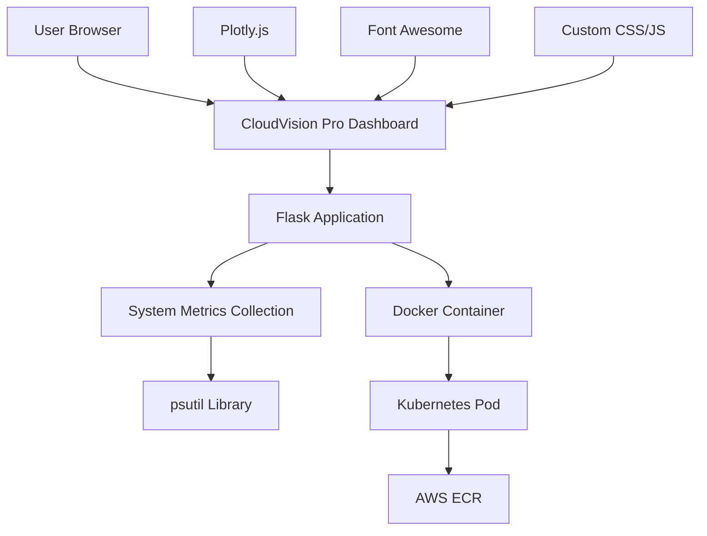

# 🚀 CloudVision Pro - Advanced System Monitor

<div align="center">


**A next-generation cloud-native system monitoring solution with enterprise-grade UI/UX**

[Features](#-features) • [Demo](#-demo) • [Quick Start](#-quick-start) • [Architecture](#-architecture) • [Deployment](#-deployment)

</div>

## 📸 Dashboard Preview


> **Live Dashboard showing real-time CPU and Memory monitoring with professional glassmorphism UI design**

## ✨ Features

### 🎨 **Modern UI/UX Design**
- **Glassmorphism Interface**: Translucent cards with backdrop blur effects
- **Dark Theme**: Professional gradient backgrounds with animated particles
- **Responsive Design**: Optimized for desktop, tablet, and mobile devices
- **Real-time Updates**: Auto-refresh every 30 seconds with smooth animations

### 📊 **Advanced Monitoring**
- **Dual Visualization**: Interactive Plotly gauges + animated progress bars
- **Smart Alerts**: Dynamic color-coded status indicators
- **Resource Tracking**: Real-time CPU and Memory utilization
- **Threshold Monitoring**: Automatic warnings when resources exceed 80%

### 🏗️ **Cloud-Native Architecture**
- **Containerized**: Docker-ready with optimized multi-stage builds
- **Kubernetes Native**: Production-ready deployment manifests
- **AWS Integration**: ECR for container registry
- **Scalable**: Horizontal pod autoscaling support

### 🔧 **Enterprise Features**
- **Professional Branding**: Custom "CloudVision Pro" identity
- **Status Dashboard**: System health indicators
- **Live Metrics**: Real-time performance data
- **Auto-scaling Alerts**: Infrastructure scaling recommendations

## 🚀 Quick Start

### Prerequisites
- Python 3.12+
- Docker Desktop
- Kubernetes cluster (minikube, Docker Desktop, or cloud)
- AWS CLI (for ECR deployment)

### Local Development

```bash
# Clone the repository
git clone <your-repo-url>
cd cloud_native_monitoring

# Install dependencies
pip install -r requirements.txt

# Run the application
python app.py
```

Visit `http://localhost:8080` to see your CloudVision Pro dashboard! 🎉

### Docker Deployment

```bash
# Build the image
docker build -t cloudvision-pro .

# Run the container
docker run -p 8080:8080 cloudvision-pro
```

## 🏗️ Architecture



### Technology Stack

| Layer | Technology | Purpose |
|-------|------------|---------|
| **Frontend** | HTML5, CSS3, JavaScript | Modern responsive UI |
| **Visualization** | Plotly.js | Interactive gauges and charts |
| **Backend** | Python 3.12, Flask | Web application framework |
| **Monitoring** | psutil | System metrics collection |
| **Containerization** | Docker | Application packaging |
| **Orchestration** | Kubernetes | Container orchestration |
| **Registry** | AWS ECR | Container image storage |
| **Icons** | Font Awesome 6 | Professional iconography |

## 🐳 Docker Configuration

The application uses a multi-stage Docker build for optimal security and performance:

```dockerfile
FROM python:3.12-slim

# Install build dependencies and clean up
RUN apt-get update && apt-get install -y gcc python3-dev && \
    pip3 install --no-cache-dir -r requirements.txt && \
    apt-get remove -y gcc python3-dev && apt-get autoremove -y

EXPOSE 8080
CMD ["python", "app.py"]
```

## ☸️ Kubernetes Deployment

### Deploy to Kubernetes

```bash
# Deploy the application
kubectl apply -f k8s/

# Check deployment status
kubectl get pods -l app=cloudvision-pro

# Access via port forwarding
kubectl port-forward service/cloudvision-service 8080:8080
```

### Production Deployment with ECR

```bash
# Login to ECR
aws ecr get-login-password --region us-east-1 | docker login --username AWS --password-stdin <your-account>.dkr.ecr.us-east-1.amazonaws.com

# Build and push
docker build -t <your-account>.dkr.ecr.us-east-1.amazonaws.com/cloudvision-pro:latest .
docker push <your-account>.dkr.ecr.us-east-1.amazonaws.com/cloudvision-pro:latest

# Update Kubernetes deployment
kubectl set image deployment/cloudvision-pro cloudvision-container=<your-account>.dkr.ecr.us-east-1.amazonaws.com/cloudvision-pro:latest
```


## 📊 Monitoring Metrics

The application tracks and displays:

- **CPU Utilization**: Real-time processor usage percentage
- **Memory Usage**: RAM consumption with available/used breakdown
- **System Status**: Overall health indicators
- **Performance Trends**: Historical usage patterns (planned)

## 🚨 Alerts and Notifications

CloudVision Pro provides intelligent monitoring with:

- **Visual Alerts**: Color-coded status indicators
- **Threshold Warnings**: Automatic alerts at 80% resource usage
- **Scaling Recommendations**: Suggestions for infrastructure scaling
- **Status Dashboard**: Overview of system health metrics

## 🔒 Security Features

- **Minimal Attack Surface**: Slim Docker base image
- **Dependency Security**: Regularly updated Python packages
- **Container Security**: Non-root user execution
- **Network Security**: Kubernetes network policies support

## 🤝 Contributing

We welcome contributions! Please follow these steps:

1. Fork the repository
2. Create a feature branch (`git checkout -b feature/amazing-feature`)
3. Commit your changes (`git commit -m 'Add amazing feature'`)
4. Push to the branch (`git push origin feature/amazing-feature`)
5. Open a Pull Request

### Development Setup

```bash
# Create virtual environment
python -m venv venv
source venv/bin/activate  # On Windows: venv\Scripts\activate

# Install development dependencies
pip install -r requirements.txt

# Run in development mode
FLASK_ENV=development python app.py
```

## 📝 License

This project is licensed under the MIT License - see the [LICENSE](LICENSE) file for details.


**⭐ Star this repository if you find it helpful!**

**Made with ❤️ for the cloud-native community**

